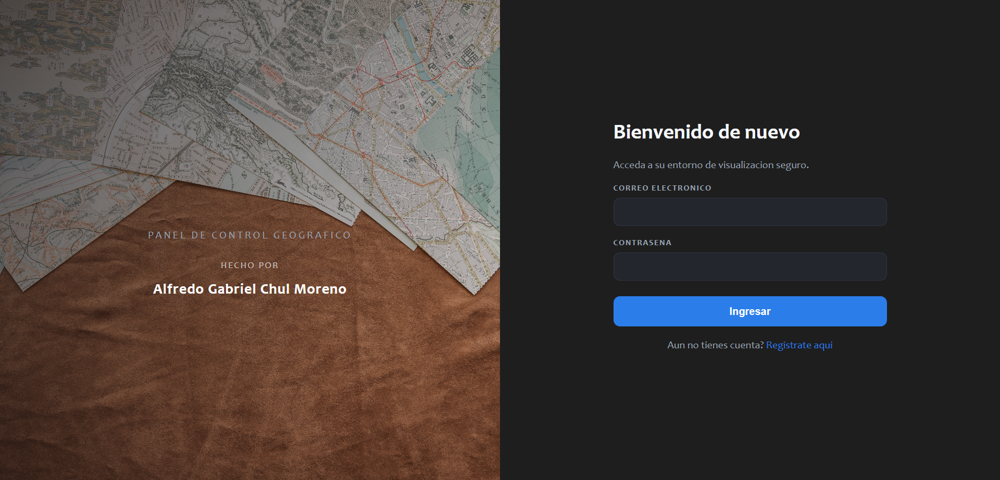
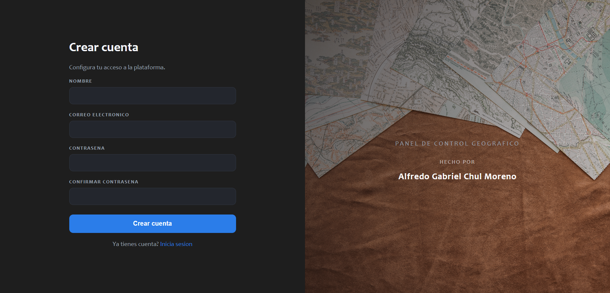
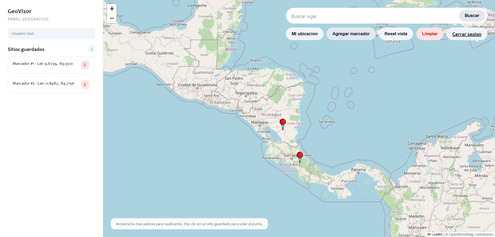

# Prueba Tecnica - Analista Programador

App web con:
- Registro e inicio de sesion en una sola vista.
- Mapa interactivo con marcadores arrastrables y lista de sitios guardados.
- Buscador de lugares y geolocalizacion bajo permiso del usuario.
- Enfoque en seguridad (sesiones, CSRF, rate limit, cifrado de storage).

## Stack
- PHP 8.5.x (sin framework)
- HTML/CSS/JS
- Leaflet + OpenStreetMap
- Photon (geocoding)

## Estructura
- app/
  - services/
- public/
  - assets/css/
  - assets/js/
  - assets/img/
- storage/

## Ejecucion local
1. Asegura PHP 8.5.x instalado.
2. En la raiz del proyecto, ejecuta:
   ```bash
   php -S localhost:8000 -t public
   ```
3. Abre `http://localhost:8000`.

## Capturas




## Seguridad aplicada
- Sesiones endurecidas (strict mode, cookies only, samesite strict).
- CSRF con rotacion de token.
- Rate limit por IP y por email.
- Cifrado AES-256-GCM para `users.json`.
- Headers CSP, HSTS (solo HTTPS) y politicas de permisos.
- Logs de auditoria con hash encadenado.

## Notas
- No se usa base de datos; se usa almacenamiento en archivo cifrado.
- `storage/.htaccess` bloquea acceso web directo a archivos sensibles.
- `.gitkeep` se usa para versionar carpetas vacias.
- `storage/*.json` y `storage/audit.log` se generan en runtime y se ignoran en git.